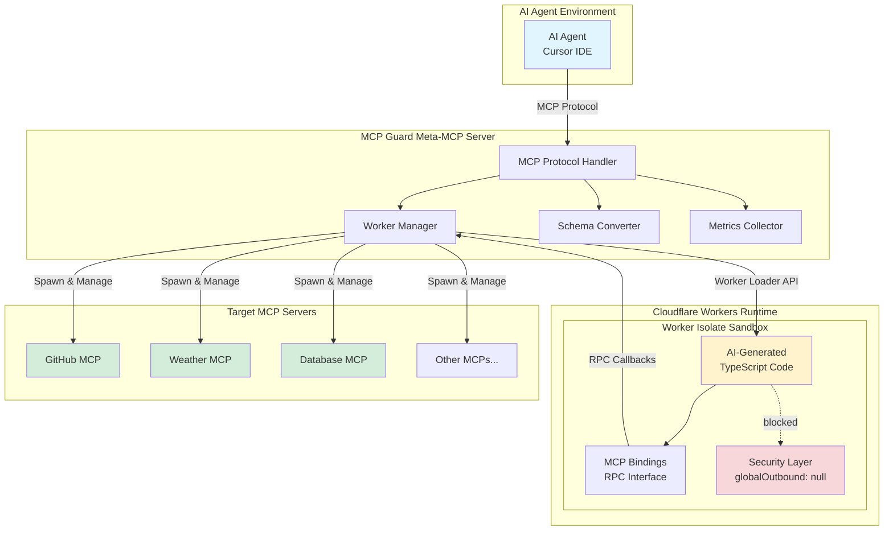
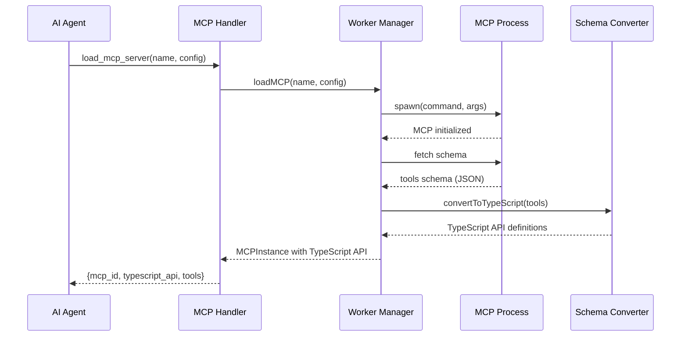
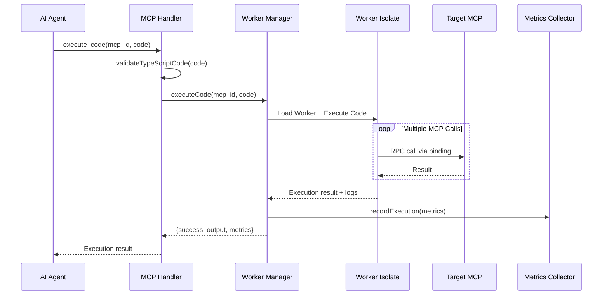
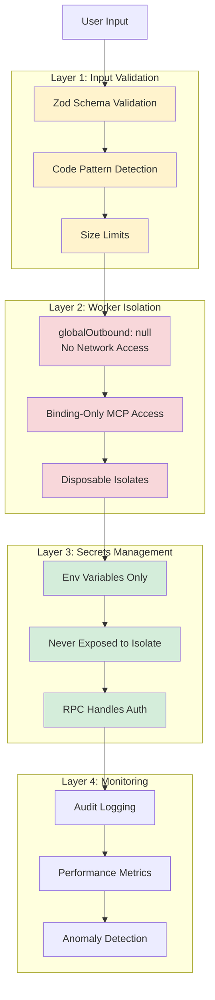
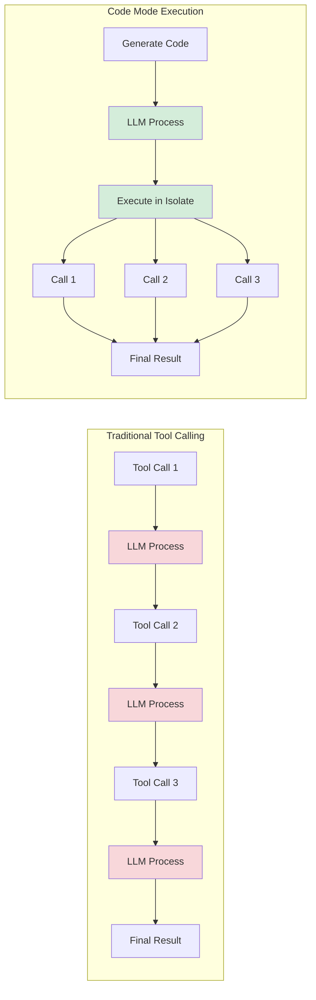
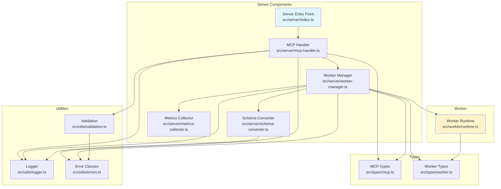
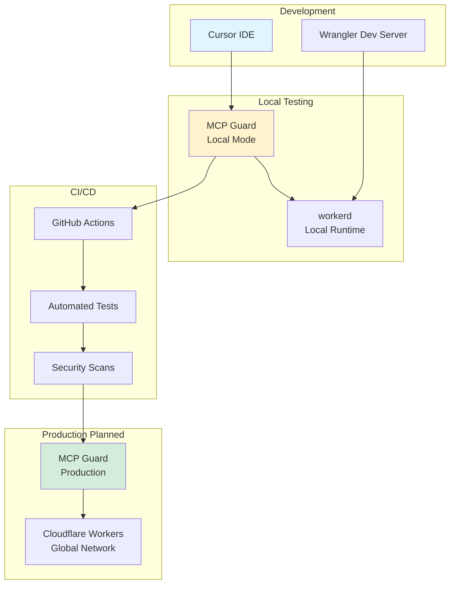
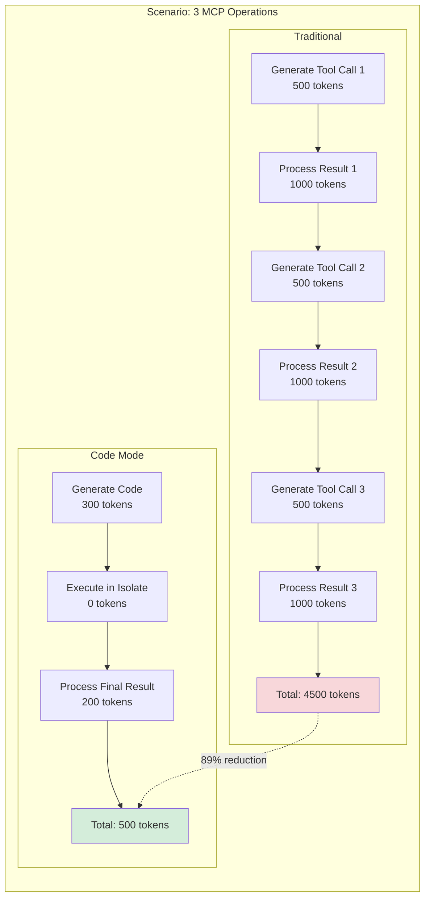

# MCP Guard - Architecture Diagrams

## System Architecture

## Data Flow - Loading an MCP

## Data Flow - Executing Code

## Security Layers

## Performance Comparison

**Traditional**: 3 LLM round-trips, ~7,500 tokens
**Code Mode**: 1 LLM round-trip, ~800 tokens
**Improvement**: 89% token reduction, 5x faster

## Component Interaction Map

## Deployment Architecture

## Token Usage Comparison

---

## How to Use These Diagrams

### In Markdown Viewers
Most modern markdown viewers (GitHub, VS Code, etc.) will render Mermaid diagrams automatically.

### In Documentation
Copy the Mermaid code blocks into your documentation files.

### As Images
Use tools like [Mermaid Live Editor](https://mermaid.live/) to export as PNG/SVG.

### In Presentations
Export as images and include in slides to explain architecture to stakeholders.

---

These diagrams illustrate:
1. **System Architecture** - Overall component structure
2. **Data Flow** - How requests move through the system
3. **Security Layers** - Defense-in-depth approach
4. **Performance Comparison** - Why code mode is better
5. **Component Interactions** - How code modules relate
6. **Deployment Architecture** - Dev to production flow
7. **Token Usage** - Concrete efficiency improvements
