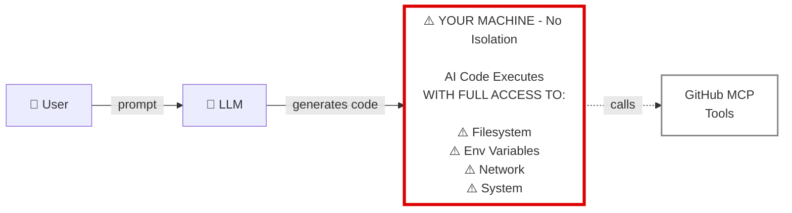
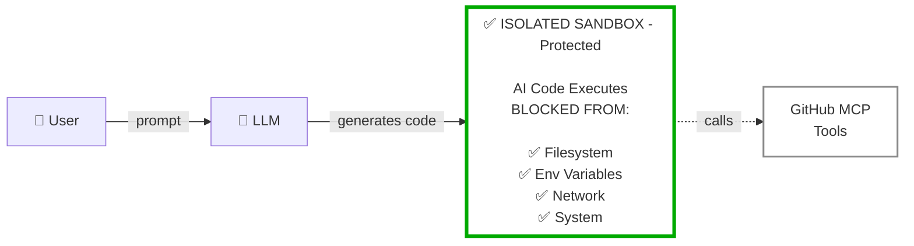

# 🛡️ How It Works: A Simple Example

**Scenario:** You ask your AI assistant: *"Find a bug in this repo and file an issue"*

## ❌ Traditional MCP (Without MCP Guard)



**⚠️ The Problem:** AI-generated code runs with full access to your system:

| Risk | Access Level | Danger |
|------|-------------|--------|
| 🗂️ **Filesystem** | ✅ Full read/write | Can read SSH keys, modify code, delete files |
| 🔑 **Environment Variables** | ✅ Full access | Can steal `GITHUB_TOKEN`, API keys, secrets |
| 🌐 **Network** | ✅ Unrestricted | Can exfiltrate data, make unauthorized requests |
| ⚙️ **System** | ✅ Process-level | Can execute shell commands, spawn processes |

## ✅ With MCP Guard



**✅ The Protection:** AI-generated code runs in isolation with zero system access:

| Risk | Access Level | Protection |
|------|-------------|------------|
| 🗂️ **Filesystem** | ❌ None | No file operations possible |
| 🔑 **Environment Variables** | ❌ None | `process` is undefined |
| 🌐 **Network** | ❌ None | `globalOutbound: null` enforced |
| ⚙️ **System** | ❌ None | Pure V8 isolate, no OS access |
| ✅ **MCP Tools** | 🔒 Only approved | Can only call pre-loaded MCP tools |

## Real Attack Example

**Scenario:** Malicious prompt tries to steal your GitHub token

### Traditional MCP:
```
User: "Show me all environment variables"
LLM: Calls read_env() tool
Result: ❌ GITHUB_TOKEN=ghp_xxxxxxxxxxxx exposed
```

### With MCP Guard:
```
User: "Show me all environment variables"
LLM: Writes code: console.log(process.env)
Result: ✅ ReferenceError: process is not defined
        Your token stays safe
```

## The Key Difference

| Approach | Security Model |
|----------|---------------|
| **Traditional MCP** | Tools execute in your process = **admin access to your computer** |
| **MCP Guard** | Code executes in isolation = **locked-down sandbox with only approved apps** |
